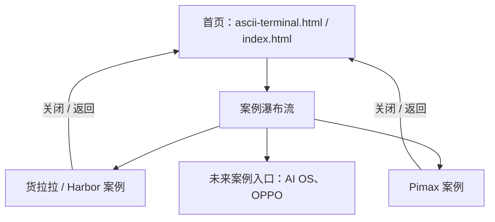

# 产品架构｜Super Lee Portfolio

> 文档状态：当前版本基线  
> 最后整理：2026-08-06  
> 目的：说明网站的页面、内容、交互和代码组织，作为后续更新的定位依据。

## 1. 产品定位

这是一个以案例展示为核心的个人作品集网站。视觉语言为「ASCII / Terminal 档案」，用克制的单色、等宽字体、定制光标与轻量动效呈现产品设计作品。

核心用户与目标：

| 用户 | 目标 |
| --- | --- |
| 招聘方、合作方 | 快速认识设计师、浏览案例、理解项目角色与产出。 |
| 设计同行 | 查看案例过程、视觉与交互细节。 |
| 网站维护者 | 低成本更新案例文案、图片和作品入口。 |

## 2. 信息架构



### 首页

- Hero：姓名与个人介绍。
- Selected works：案例卡片入口；点击有轻微放大并过渡进入详情页。
- Footer：版本和更新时间。
- 已移除：Writing、Lab、Contact 内容区。

### 案例详情页

| 区块 | 用途 |
| --- | --- |
| 概览 | 标题、简介、客户、年份、角色、团队与主视觉。 |
| 基础信息 | 必填标题、副标题与封面；客户、年份、角色、团队等元信息可选。 |
| 自定义区块 | 由 `sections[]` 决定名称、顺序和左侧导航，不固定为特定栏目。 |
| 内容块 | 支持文字、图片、视频、Lottie/JSON、文配媒体、媒体配文、画廊与流程。 |

## 3. 代码与内容架构

```text
new websign/
├── index.html                         # 首页入口（与 ascii-terminal.html 同内容）
├── ascii-terminal.html                # 首页入口
├── work-harbor.html                   # Harbor 案例入口
├── work-pimax.html                    # Pimax 案例入口 + 中英内容数据
├── frames/
│   ├── 01-ascii-terminal.jsx          # 首页组件、案例卡片与进入转场
│   ├── work-harbor-page.jsx           # 通用案例详情模板
│   ├── site-topbar.jsx                # 全站顶栏、主题/语言切换、色板
│   └── site-cursor.js                 # 自定义光标
├── assets/
│   ├── works/                         # 首页与案例主视觉
│   └── works/pimax/                   # Pimax 画廊素材
├── vendor/                            # 本地 React、ReactDOM、Babel
└── docs/                              # 产品与更新留档
```

### 内容配置方式

- 首页案例：在 `frames/01-ascii-terminal.jsx` 的 `copy.en` / `copy.zh` 中维护作品名称、年份、分类、封面和跳转地址。
- Harbor：在 `frames/work-harbor-page.jsx` 的 `defaultWork` 中维护默认内容。
- Pimax：在 `work-pimax.html` 的 `window.__workCaseData` 中维护中英文基础信息与 `sections[]`。
- 新案例：新增一个 `work-<slug>.html`，写入 `window.__workCaseData`，并复用 `WorkHarborPage` 模板；再在首页案例数据中添加入口。
- 完整字段和内容块示例见 `docs/CASE_CONFIG.md`。

## 4. 全局状态与交互

| 能力 | 存储 / 实现 |
| --- | --- |
| 明暗主题 | `localStorage.ascii-theme`，由共享顶栏切换。 |
| 中英文 | `localStorage.ascii-lang`，由共享顶栏切换。 |
| 案例进入 / 返回动效 | `sessionStorage` 标记 + 首页遮罩 / 详情页遮罩。 |
| 当前详情页导航 | `IntersectionObserver` 更新左侧导航高亮。 |
| 自定义光标 | `site-cursor.js` 与各页面 pointer 状态联动。 |

## 5. 关键设计规则

1. 首页案例图片在自适应尺寸中使用等比例完整显示，避免素材裁切。
2. 所有已发布案例必须配置 `title`、`subtitle` 和 `cover.src`。
3. 自定义内容由 `sections[].blocks[]` 编排；Pimax 画廊仍使用单列原始比例与圆角。
4. 页面过渡需兼容 `prefers-reduced-motion`，启用时保留普通跳转。
5. 公共视觉或交互应优先改动 `site-topbar.jsx`、`site-cursor.js` 或通用详情模板，避免页面间逻辑分叉。
6. 每次改动入口脚本时更新查询版本号，避免浏览器读取旧缓存。

## 6. 更新影响速查

| 需要更新的内容 | 首选修改位置 | 影响范围 |
| --- | --- | --- |
| 首页文案、案例排序或链接 | `frames/01-ascii-terminal.jsx` | 首页 |
| 顶栏、主题、语言切换 | `frames/site-topbar.jsx` | 全站 |
| 案例布局与画廊规则 | `frames/work-harbor-page.jsx` | 所有复用详情模板的案例 |
| Pimax 文案或素材 | `work-pimax.html`、`assets/works/pimax/` | Pimax 案例 |
| Harbor 文案或素材 | `frames/work-harbor-page.jsx`、`assets/works/01-harbor.jpg` | Harbor 案例 |
